# Safekeeping For FFX 

This is an app I put together since the app I'd once used is no longer available on the Google Play Store - [Checklist for FFX](https://checklist-for-ffx.en.softonic.com/android?ex=RAMP-4479.1&rex=true)

Final Fantasy X is probably my all-time favorite game, so I figured rather than continuing to use that older app (that will probably no longer work at some point), I'd just put one together myself in case others are looking for a tracking app to use themselves.

## Full Transparency
I primarily used Claude Code for this app. I'm no programmer, and given this app is purely for information/tracking purposes, and the information is widely available over the life of the game and its iterations, I was okay with having it write just about all of the app.

The information inside the app comes from various online sources and community references.

## Main Goals of this app

- Track progress of various things in the game
- Something relatively easy to use and has everything I'd need without needing to pull it up via web browser
- Easy to search within the app
- Utilize information from the official guide
- No Internet requirements (ideally screenshots will just be bundled inside the app so it can be fully offline-capable)
- No ads

### App Functionality

- Al Bhed Primers and their locations
- Jecht Spheres and their locations
- Celestial Weapons and their locations
- Ronso Rages for Kimahri and the targets
- Besaid Auroch Blitzball Team Key Techniques
- All possible Blitzball Recruits from other teams & free agents
- All Weapon and Armor abilities
- List of Items
- Monster Arena tracking, along with their associated Gil cost, Common/Rare Steals, Win Items, Bribe Amount, and the item from that Bribe (if available)
- Mix Overdrive Calculator, with a reverse search to see what items would be needed for a given result
- Sphere Grid Planner - a pan/zoom view of the full Standard (860 nodes) and Expert (805 nodes) Sphere Grids, switchable via the grid-type selector. Tap a node to see its content, edit it (Clear Sphere customization), or activate it. Node edits are shared like the real grid, while each of the 7 characters tracks their own activated path. Each grid remembers its own pan/zoom position, with a button to reset the view.
- Sphere Grid Routes - Create your own routes, and save them on your device, or export for others to import.
- Character Status - a slide-up readout of what the grid in view has made of a character, swipeable across Attributes, Skills, Abilities, White Magic and Black Magic. Stats are each character's base values plus every activated node, with the in-game cap flagged once a stat maxes out, and each ability page shows what has been learned alongside what the grid still holds. Characters can be switched from inside the sheet without losing your place, and the grid is already showing whoever you picked last when you dismiss it.

### Screenshots

  
Click to see screenshots

  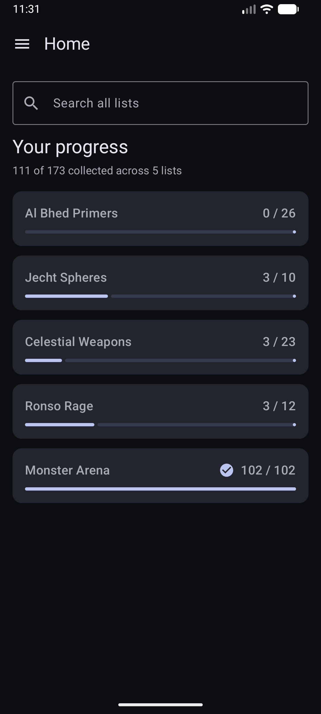
  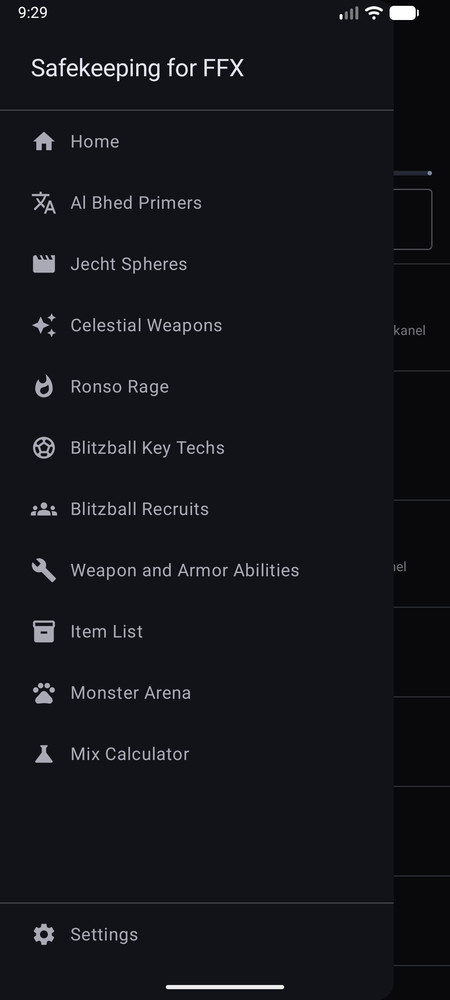
  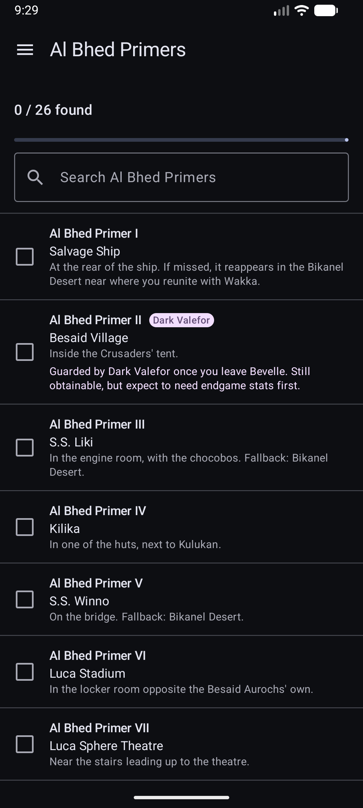
  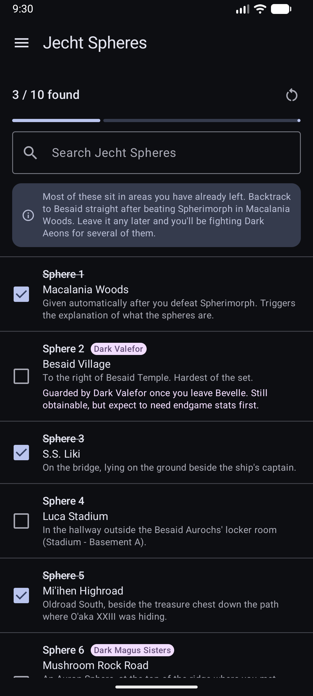
  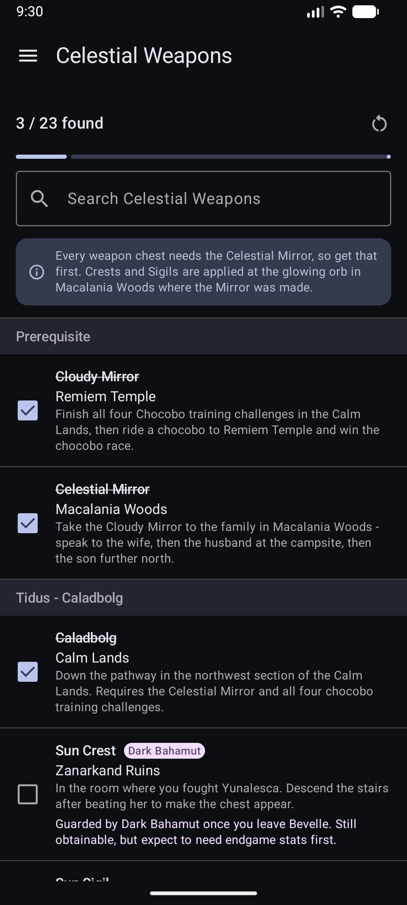
  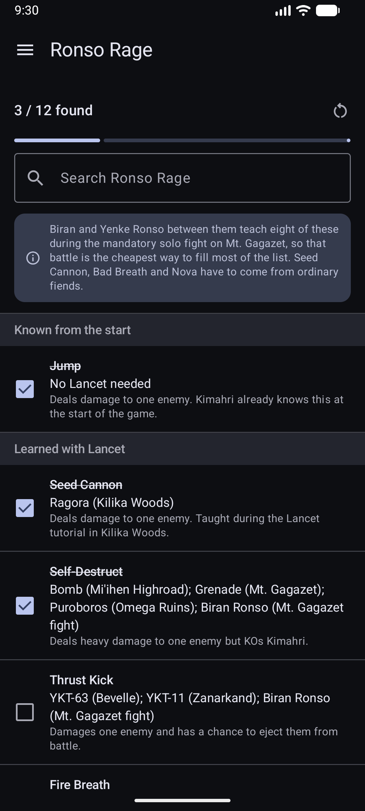
  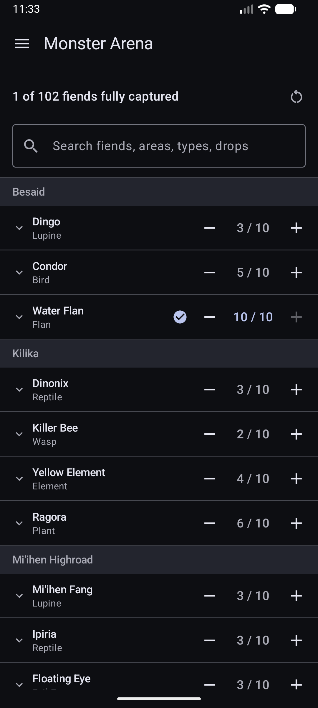
  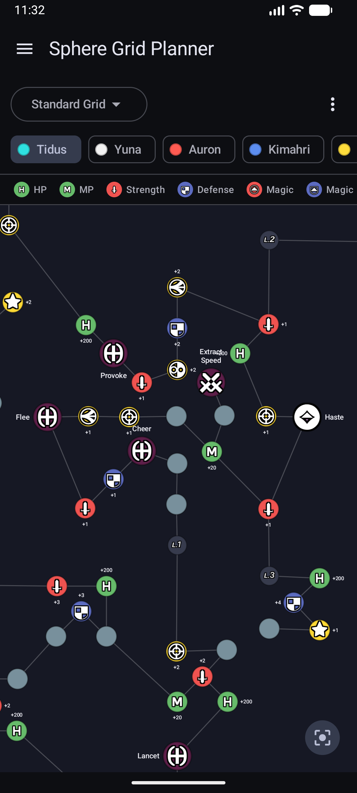
  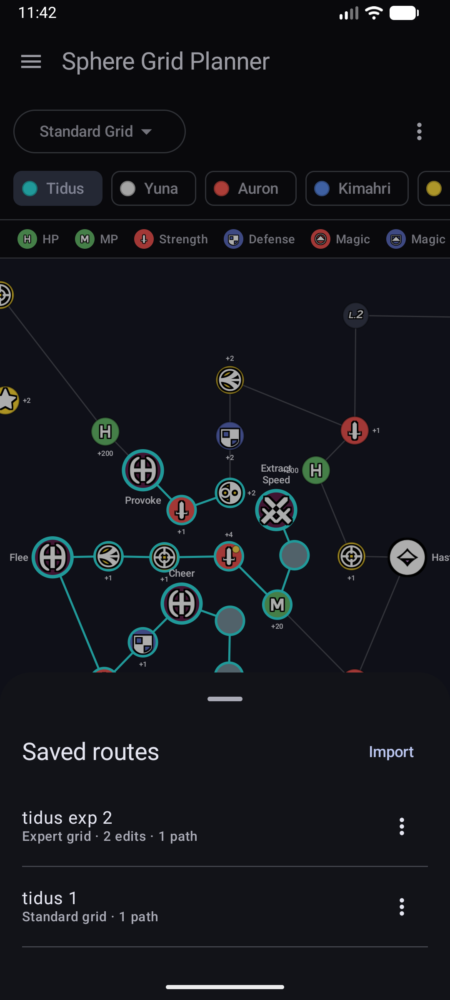
  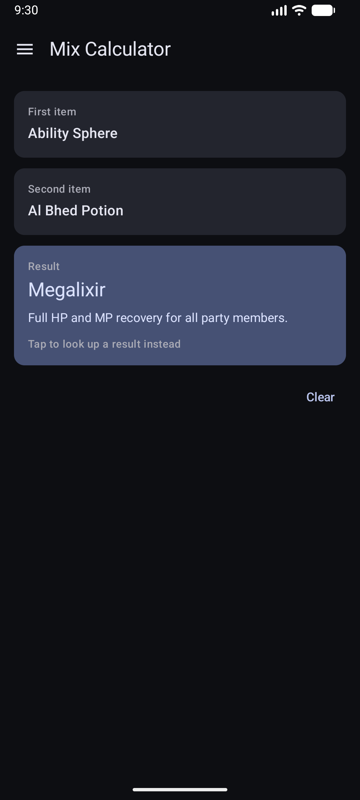
  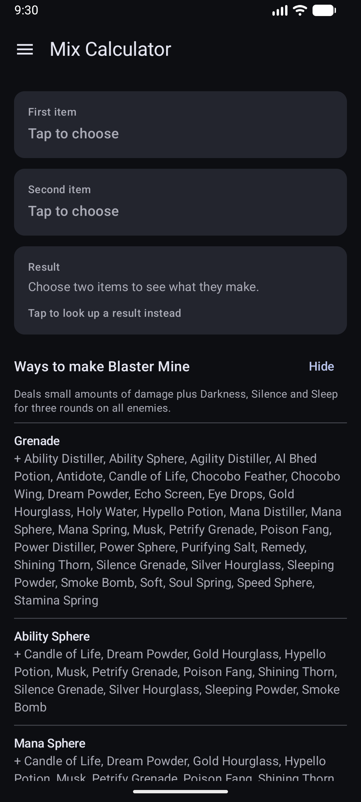
  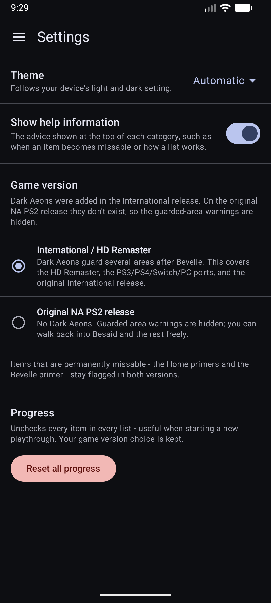

### Settings

- Theme options - Light/Dark/OLED-friendly/Automatic
- Toggle to show/hide the help information
- Toggle for Sphere Grid to have tap-to-activate.
  - This will make it much faster to plan out a route if you're taking defaults. Long-press a node to get the editing options
- Game Version toggle since the Dark Aeons don't exist in the original NA PS2 release of the game, which hides appropriate irrelevant information
- Progress Reset button

### Credits

- Standard Sphere Grid layout data adapted from the [theroymind/ffx-helper](https://github.com/theroymind/ffx-helper) project.
- Expert Sphere Grid data, and corrections to the Standard grid, from the game-extracted data in [Grayfox96/FFX-Sphere-Grid-viewer](https://github.com/Grayfox96/FFX-Sphere-Grid-viewer) (MIT).
- Full third-party license notices are in [THIRD-PARTY-NOTICES.md](THIRD-PARTY-NOTICES.md).

### To-Do
1. Add screenshots where possible to help locate items/people
2. Add detailed fiend locations for Monster Arena

